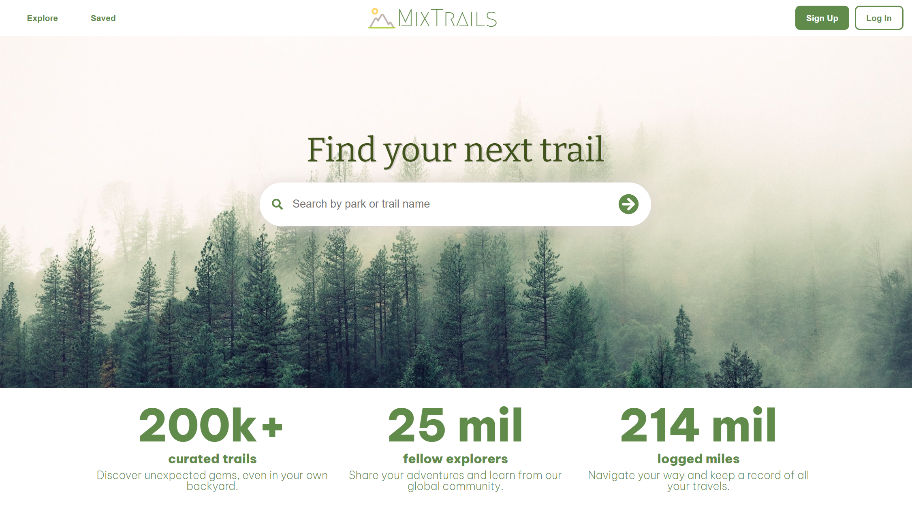
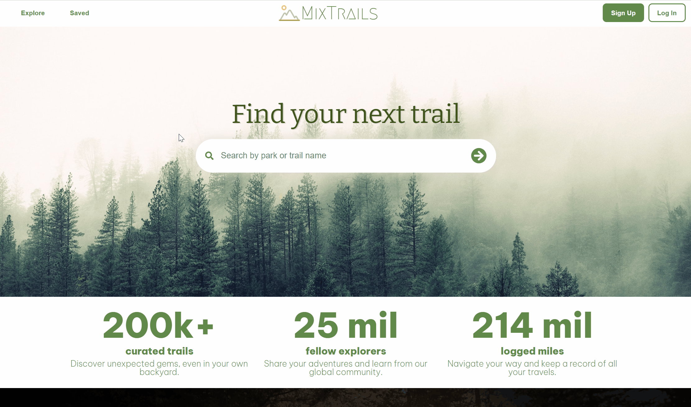

# MixTrails

## About

MixTrails is a clone of the website AllTrails, a place where users can find information about parks and trails they're interested in. Users are able to view detailed information about a specific park or trail, including but not limited to - location, difficulty, elevation, nearby trails, and much more. Users are also able to share their experience by leaving reviews and ratings about a trail with the community.

MixTrails is built with a backend that utilizes Ruby on Rails framework, PostgreSQL database, and AWS S3 for image storage. The frontend is built with React.js and Redux framework to manage state. 

## Features

### CRUD Functionality for Reviews

Users are able to see all reviews posted for a given trail when navigating through the site. When logged in, users are also able to create, edit, or delete their own review.

### Search Bar

Users are able to search for their desired trail or park by typing into the search bar. A search bar is available on every page to allow ease of access and all inputs are filtered as the user is typing.

## Future Implementation
- Allow users to upload trail photos
- Create profile page for users to save completed trails
